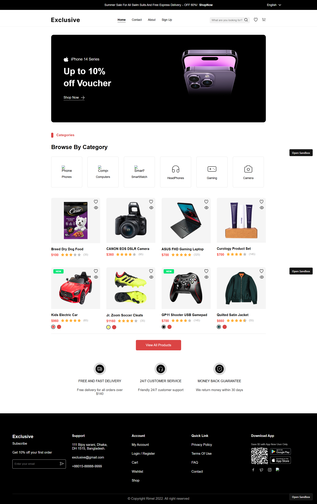

# 🛒 Exclusive E-Commerce Website

A responsive e-commerce website built using **HTML**, **CSS**, and **JavaScript**. The project features a modern shopping interface with product listings, category browsing, promotional banners, and a clean user experience.

## ✨ Features

- Responsive design
- Hero promotional banner
- Product category section
- Featured products showcase
- Product ratings and pricing
- Wishlist & cart icons
- Customer service highlights
- Modern footer with quick links

## 🛠️ Technologies Used

- HTML5
- CSS3
- JavaScript

## 📂 Project Structure

```text
exclusive/
│
├── assets/
│   ├── images/
│   └── icons/
│
├── css/
│   └── style.css
│
├── js/
│   └── script.js
│
├── index.html
└── README.md
```

## 📸 Preview

### Homepage



## 🚀 Getting Started

1. Clone the repository

```bash
git clone https://github.com/Nihal-Kappungal/exclusive-ecommerce.git
```

2. Navigate to the project directory

```bash
cd exclusive
```

3. Open `index.html` in your browser

## 🎯 Learning Outcomes

This project helped practice:

- HTML page structure
- CSS Flexbox & Grid
- Responsive web design
- JavaScript DOM manipulation
- E-commerce UI development
